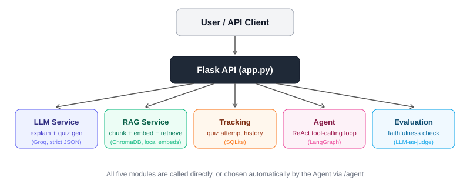

# 🎓 AI Study Companion


A backend-only AI study tool built to learn and demonstrate the modern GenAI stack end to end — LLM basics, structured output, RAG, persistence, agentic tool-calling, and evaluation. No frontend yet by design, built to be tested directly via the API to keep the focus on the AI engineering. 🚀

---

## ✨ What it does

- 📖 **Explains** a topic in simple terms (`/explain`)
- 📝 **Generates** a schema-guaranteed multiple-choice quiz on a topic (`/quiz`)
- 📚 **Grounds** both of the above in your own uploaded notes via RAG, when relevant notes exist (`/upload`)
- 📊 **Tracks** quiz performance over time and surfaces weak topics (`/submit-answer`, `/weak-topics`)
- 🤖 **Runs as an agent** that decides on its own which of the above to use, given a plain natural-language request (`/agent`) — e.g. *"quiz me on my weak topics"* triggers a check-weak-topics-then-quiz tool chain automatically

---

## 🏗️ Architecture



| Layer | File | What it does |
|---|---|---|
| 🧠 LLM calls | `llm_service.py` | Explanation generation, schema-enforced quiz generation (Groq Structured Outputs, `strict: true`) |
| 📚 RAG | `rag_service.py` | PDF text extraction, chunking with overlap, embedding (Sentence-Transformers, local), ChromaDB storage/retrieval with a cosine-similarity threshold |
| 💾 Persistence | `tracking_service.py` | SQLite — records every quiz attempt, computes per-topic accuracy |
| 🤖 Agent | `agent_service.py` | LangGraph ReAct loop — wraps the above as tools an LLM chooses between, with decision logging |
| 🔍 Evaluation | `evaluation_service.py` | LLM-as-judge faithfulness check — verifies a generated answer is actually grounded in its retrieved context, not hallucinated |
| 🌐 API | `app.py` | Flask routes tying it all together |

**Model:** `openai/gpt-oss-120b` via Groq (fast inference, supports both Structured Outputs and tool calling).

---

## ⚙️ Setup

```bash
pip install -r requirements.txt
```

Copy `.env.example` → `.env`, add a real `GROQ_API_KEY` (free at [console.groq.com/keys](https://console.groq.com/keys)):

```bash
python app.py
```

---

## 📡 API Reference

**📤 Upload notes for RAG grounding**
```powershell
curl.exe -X POST http://127.0.0.1:5000/upload -F "file=@notes.pdf"
```

**💡 Explain a topic** *(auto-grounded in notes if relevant ones are indexed)*
```powershell
Invoke-RestMethod -Uri "http://127.0.0.1:5000/explain" -Method Post -ContentType "application/json" -Body '{"topic": "types of AI"}'
```

**📝 Generate a quiz**
```powershell
Invoke-RestMethod -Uri "http://127.0.0.1:5000/quiz" -Method Post -ContentType "application/json" -Body '{"topic": "recursion", "num_questions": 3}'
```

**✅ Submit a quiz answer** *(feeds weak-topic tracking)*
```powershell
Invoke-RestMethod -Uri "http://127.0.0.1:5000/submit-answer" -Method Post -ContentType "application/json" -Body '{"topic": "recursion", "question": "...", "difficulty": "easy", "user_answer": "...", "correct_answer": "..."}'
```

**📊 Check weak topics**
```powershell
Invoke-RestMethod -Uri "http://127.0.0.1:5000/weak-topics" -Method Get
```

**🤖 Talk to the agent directly** *(it decides which tools to use)*
```powershell
Invoke-RestMethod -Uri "http://127.0.0.1:5000/agent" -Method Post -ContentType "application/json" -Body '{"message": "quiz me on my weak topics"}'
```

---

## 🧪 Testing

Standalone scripts in `/tests` for checking retrieval and faithfulness in isolation, outside the full API:

```bash
python tests/test_retrieval.py
python tests/test_faithfulness.py
```

---

## 💡 Notable Engineering Decisions

- **🎯 Structured Outputs with `strict: true`** for quiz generation, instead of few-shot prompting alone — guarantees schema-valid JSON via constrained decoding. Found and fixed a real gap where array length constraints (`options` must have exactly 4 items) weren't enforced even in strict mode, requiring manual post-validation.
- **📏 Similarity-threshold filtering on retrieval** — rather than always injecting the top-k retrieved chunks regardless of relevance, chunks below a cosine similarity threshold are dropped, so weakly-related content doesn't get mislabeled as "grounded."
- **🔧 Tool artifacts over LLM re-narration** — the agent's `generate_quiz` tool returns structured quiz data as a LangChain "artifact" that bypasses the LLM's final response entirely, after finding that letting the agent retype quiz content in prose intermittently dropped questions/options.
- **⚖️ LLM-as-judge faithfulness checking** — a separate evaluation call verifies generated answers don't introduce claims unsupported by retrieved context, catching subtle grounding failures that pass a normal read-through.

---

## ☁️ Deployment

Includes a `Procfile` for [Render](https://render.com) (`gunicorn app:app`). Set `GROQ_API_KEY` as an environment variable in the hosting platform's dashboard — `.env` is gitignored and won't be present on the server.

---

<p align="center"><i>Built as a hands-on, project-first way to learn the GenAI/agentic AI stack — one working feature at a time. 🎯</i></p>
